# 🖼️ PhotoStudio - An Image Generation with Editing Features 

[](https://opensource.org/licenses/MIT)
[](https://nextjs.org/)
[](https://fastapi.tiangolo.com/)
[](https://github.com/langchain-ai/langgraph)

**PhotoStudio AI** is an intelligent, full-stack photo editing and generation app. Users can generate, erase, edit, analyze, or upscale images using natural language. Powered by an agent-based system with **LangGraph**, it intelligently routes user intent to the correct AI module.

---

## 🌟 Features

- 🎨 AI Image Generation (Text-to-Image)
- 🧼 Erase unwanted image regions
- ✏️ Edit specific image areas using natural language
- 🔍 Analyze image content (objects, colors, composition)
- 📈 Upscale low-resolution images
- 🧠 LangGraph Agent Manager for routing tasks to correct AI agent

---

## 🧠 LangGraph Agent Architecture

The LangGraph Manager receives user input and routes it to the correct agent based on the intent detected:

```mermaid
graph TD
    User["🧑 User Prompt"] --> ManagerNode
    LangGraphManager -->|Intent: generate| ImageGeneratorAgent
    LangGraphManager -->|Intent: erase| EraseAgent
    LangGraphManager -->|Intent: edit| EditAgent
    LangGraphManager -->|Intent: analyze| AnalyzerAgent
    LangGraphManager -->|Intent: upscale| UpscaleAgent

```


---
## 📦 Installation

# Backend

1. Clone the repository

```bash
git clone https://github.com/pavanraut131/photostudio.git
cd photostudio/media-gallery-backend
```
2. Create and activate a virtual environment:

```bash
# Create a virtual environment
python -m venv env

# Activate the virtual environment on Windows
env\Scripts\activate

# On macOS/Linux, use:
source env/bin/activate
```
3. Install dependencies:
```bash
pip install -r requirements.txt
```
4. Start the Development server
```bash
uvicorn app:app --reload
```

# Frontend
1. Get onto the folder
```bash
cd photostudio/frontend
```
2. Install dependencies:
```bash
npm install
```
3. Run the frontend:
```bash
npm run dev 
```


   

